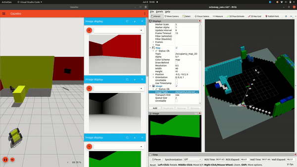
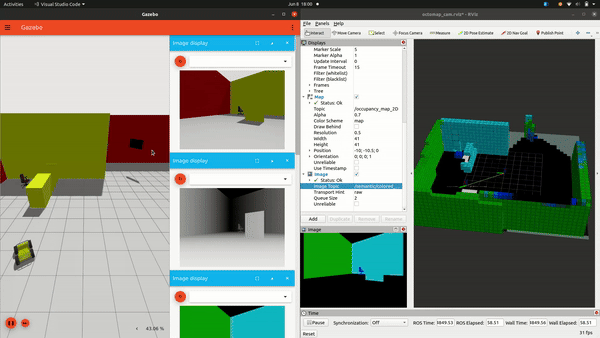

# LTLCodeGen: Code Generation of Syntactically Correct Temporal Logic for Robot Task Planning

[**Project Page**](https://existentialrobotics.org/LTLCodeGen/) |[**ArXiv**](https://arxiv.org/abs/2503.07902) |[**Video**](https://www.youtube.com/watch?v=T4Up0Uy2Ec4)

We proposed a new framework to explore and search for the language descriptive targets in unknown environment based on Large Vision Language Model. Our work is based on [Concept-Graph](https://github.com/concept-graphs/concept-graphs?tab=readme-ov-file) and [L3MVN](https://sites.google.com/view/l3mvn), implemented in PyTorch. Part of this work was conducted during the first author’s internship at Tencent Robotics X.

**Author:** Behrad Rabiei<sup>*, Mahesh Kumar A.R.<sup>*, Zhirui Dai, Surya L.S.R. Pilla, Qiyue Dong, Nikolay Atanasov

**Affiliation:** Contextual Robotics Institute, University of California San Diego


## Abstract

This paper focuses on planning robot navigation tasks from natural language specifications. We develop a modular approach, where a large language model (LLM) translates the natural language instructions into a linear temporal logic (LTL) formula with propositions defined by object classes in a semantic occupancy map. The LTL formula and the semantic occupancy map are provided to a motion planning algorithm to generate a collision-free robot path that satisfies the natural language instructions. Our main contribution is LTLCodeGen, a method to translate natural language to syntactically correct LTL using code generation. We demonstrate the complete task planning method in real-world experiments involving human speech to provide navigation instructions to a mobile robot. We also thoroughly evaluate our approach in simulated and real-world experiments in comparison to end-to-end LLM task planning and state-of-the-art LLM-to-LTL translation methods.


## System requirement
1. Ubuntu 20.04 (Focal Fossa)
    - If not already installed, follow this link to install ROS Noetic [ROS Noetic installation](https://wiki.ros.org/noetic/Installation/Ubuntu)

2. Gazebo Fortress
    - Follow this link to install Gazebo Fortress via apt PPA: [Gazebo Fortress installation](https://gazebosim.org/docs/fortress/install_ubuntu)

3. Teleop Twist and Skimage
    - You may need to install Teleop Twist Keyboard via apt (`sudo apt-get install ros-noetic-teleop-twist-keyboard`) and [skimage via pip](https://scikit-image.org/docs/stable/user_guide/install.html#installation-via-pip-and-conda)

4.  Octomap and Additional Packages 
    - `sudo apt-get install ros-noetic-octomap`
    - `sudo apt-get install ros-noetic-octomap-msgs` 
    - `sudo apt-get install ros-noetic-octomap-ros`
    - `sudo apt-get install ros-noetic-octovis`
    - `sudo apt-get install ros-noetic-vision-msgs`
    - `pip3 install ultralytics`

5. Right Simulation Version
    - (In the src area of your catkin ws) Follow the "from source" instructions from noetic branch of the following repository [ros-bridge](https://github.com/gazebosim/ros_gz/tree/noetic). It must be from source in order for the Ignition version to be Fortress, rather than Citadel.
The important shell commands to execute are:
        ```
        # in the src directory
        git clone [repo] -b noetic
        
        # in the workspace directory
        rosdep install -r --from-paths src -i -y --rosdistro noetic
        ```
       Note that we only need the folders ros_ign_gazebo and ros_ign_bridge in order to build for SOLAR. If desired, you can remove the other package directories (ros_ign, ros_ign_image, etc).

## Getting started with the repository

Inside your catkin workspace: ex: solar_ws , cd into src and clone the repository. 
This will ask for your username and personal access token a few times. 

## Running Simulation
1. Running teleop and gazebo ignition: `roslaunch jackal_solar_sim launch_jackal_roam.launch`
2. Running SSMI and yolo_seg: `roslaunch jackal_solar_sim launch_rgbd_ssmi_solar.launch` and `roslaunch yolo_seg yolo_seg.launch input_topic:=/husky_1/image`

## I. Simulation setup (Mapping)
The simulation uses ignition gazebo that has segmentation camera as a sensor module that is required for semantic octomap generation. There are 2 steps involved in simulation namely setting up ignition gazebo environment (submodule: gazebo-ignition-ros) and setting up semantic octomap generation (submodule: SSMI)

### 1. Semantic Segmentation Simulation environment
The simulation is husky robot simulation submodule containing ignition gazebo environment with RGBD and Segmentation camera. Please refer to README file of the submodule for further details of requirements and installation process.

### 2. OctoMap - SSMI

In SSMI-Mapping/params/octomap_generator.yaml, you should change the save path variable to any desired location.

Also after building with catkin, there will be a python import error due to the method catkin build uses for creating symlinks of python scripts. This error will appear if you attempt to run semantic_octomap.launch as shown below.
You will need to delete the symlinked version of semantic_sensor.py that is being used in the devel folder, and replace it with a source copy so that the class import functions properly.
Ex:
```
cd ~/solar_ws
rm devel/.private/semantic_octomap/lib/semantic_octomap/semantic_sensor.py
cp src/SOLAR/SSMI/SSMI-Mapping/scripts/semantic_sensor.py devel/.private/semantic_octomap/lib/semantic_octomap/.
```


<!-- ### Run the rosnodes
1. Terminal 1: build and launch the simulation node
```
cd ~/solar_ws
source /opt/ros/noetic/setup.bash
catkin build
source devel/setup.bash
source src/SOLAR/jackal_solar_sim/scripts/set_env_variables.sh
roslaunch jackal_solar_sim launch_jackal_solar.launch
```

2. Terminal 2: launch the semantic octomap node
```
cd ~/solar_ws
source /opt/ros/noetic/setup.bash
source devel/setup.bash
roslaunch semantic_octomap semantic_octomap.launch
```

 <div style="display: flex; justify-content: center;">
  
  
</div>
 -->
