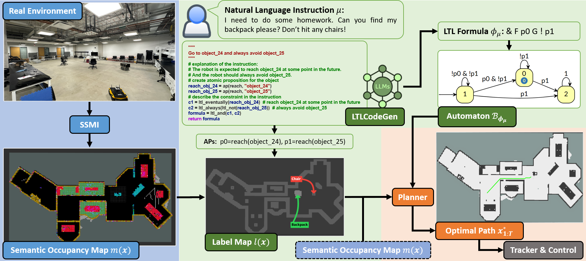
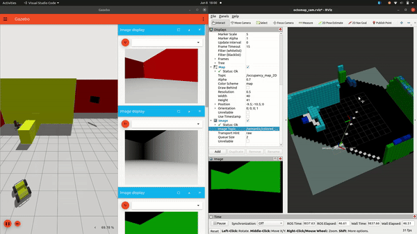
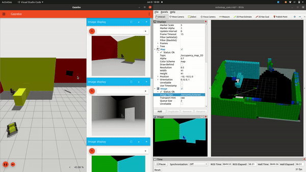

# LTLCodeGen: Code Generation of Syntactically Correct Temporal Logic for Robot Task Planning

[**Project Page**](https://existentialrobotics.org/LTLCodeGen/) |[**ArXiv**](https://arxiv.org/abs/2503.07902) |[**Video**](https://www.youtube.com/watch?v=T4Up0Uy2Ec4)

**Author:** Behrad Rabiei<sup>* </sup>, Mahesh Kumar A.R.<sup>* </sup>, Zhirui Dai, Surya L.S.R. Pilla, Qiyue Dong, Nikolay Atanasov

**Affiliation:** Contextual Robotics Institute, University of California San Diego


## Abstract

This paper focuses on planning robot navigation tasks from natural language specifications. We develop a modular approach, where a large language model (LLM) translates the natural language instructions into a linear temporal logic (LTL) formula with propositions defined by object classes in a semantic occupancy map. The LTL formula and the semantic occupancy map are provided to a motion planning algorithm to generate a collision-free robot path that satisfies the natural language instructions. Our main contribution is LTLCodeGen, a method to translate natural language to syntactically correct LTL using code generation. We demonstrate the complete task planning method in real-world experiments involving human speech to provide navigation instructions to a mobile robot. We also thoroughly evaluate our approach in simulated and real-world experiments in comparison to end-to-end LLM task planning and state-of-the-art LLM-to-LTL translation methods.



## System requirement
1. Ubuntu 20.04 (Focal Fossa)
    - If not already installed, follow this link to install ROS Noetic [ROS Noetic installation](https://wiki.ros.org/noetic/Installation/Ubuntu)

2. Gazebo Fortress
    - Install Gazebo Fortress via apt PPA: [Gazebo Fortress installation](https://gazebosim.org/docs/fortress/install_ubuntu)
    ```shell
    sudo curl https://packages.osrfoundation.org/gazebo.gpg --output /usr/share/keyrings/pkgs-osrf-archive-keyring.gpg && \
    echo "deb [arch=$(dpkg --print-architecture) signed-by=/usr/share/keyrings/pkgs-osrf-archive-keyring.gpg] http://packages.osrfoundation.org/gazebo/ubuntu-stable $(lsb_release -cs) main" | \
    sudo tee /etc/apt/sources.list.d/gazebo-stable.list > /dev/null && \
    sudo apt-get update && \
    sudo apt-get install ignition-fortress
    ```

3. Other dependencies
    ```shell
    sudo apt install \
        python3-rosdep \
        python3-rosinstall \
        python3-rosinstall-generator \
        python3-wstool \
        python3-catkin-tools \
        python3-pip \
        python3-numpy \
        python3-toml \
        python3-scipy \
        python3-tqdm \
        ros-noetic-teleop-twist-keyboard \
        ros-noetic-octomap \
        ros-noetic-octomap-msgs \
        ros-noetic-octomap-ros \
        ros-noetic-octomap-rviz-plugins \
        ros-noetic-octovis \
        ros-noetic-vision-msgs \
        nlohmann-json3-dev
    pip3 install ultralytics scikit-image
    ```

## Getting Started

### Docker Option
We provide a Dockerfile to set up the environment with all dependencies.
```shell
git clone https://github.com/ExistentialRobotics/LTLCodeGen.git
cd LTLCodeGen/docker
./build.bash
```
If you prefer to run in the host environment, you can skip the Docker option and follow the instructions below.

### Create the catkin workspace

```shell
mkdir -p <your_workspace>/src
cd <your_workspace>/src
git clone --recursive https://github.com/ExistentialRobotics/LTLCodeGen.git
git clone --recursive https://github.com/gazebosim/ros_gz.git -b noetic
# ignore some catkin packages that are not needed for this project
rm -rf ros_gz/ros_ign ros_gz/ros_ign_gazebo_demos ros_gz/ros_ign_image ros_gz/ros_ign_point_cloud
# install the ROS dependencies
cd <your_workspace>
rosdep install -r --from-paths src -i -y --rosdistro noetic
```

### Running Simulation
The entire simulation pipeline can be launched with the following command: `roslaunch jackal_solar_sim launch_sim.launch`
<!-- 
1. Running teleop and gazebo ignition: `roslaunch jackal_solar_sim launch_jackal_roam.launch`
2. Running SSMI and yolo_seg: `roslaunch jackal_solar_sim launch_rgbd_ssmi_solar.launch` and `roslaunch yolo_seg yolo_seg.launch input_topic:=/husky_1/image`
-->

## I. Simulation setup (Mapping)
The simulation uses ignition gazebo that has segmentation camera as a sensor module that is required for semantic octomap generation. There are 2 steps involved in simulation namely setting up ignition gazebo environment (submodule: gazebo-ignition-ros) and setting up semantic octomap generation (submodule: SSMI)

### 1. Semantic Segmentation Simulation environment
The simulation is husky robot simulation submodule containing ignition gazebo environment with RGBD and Segmentation camera. Please refer to README file of the submodule for further details of requirements and installation process.

In simulation, the `semantic_sensor_node` should be configured to receive a **class image** rather than a semantic image, since the semantic image generated by the Ignition Gazebo simulator does not conform to the YOLO format.

This can be achieved by modifying the `semantic_cloud.yaml` file located in the `SSMI/SSMI-Mapping/params` directory. Specifically, update the following parameters:

```yaml
semantic_image_topic: "/husky_1/class_map"
is_semantic_img_classes: true
```

- **`semantic_image_topic`**  
  Specifies the ROS topic from which the node subscribes to the class image generated in simulation.

- **`is_semantic_img_classes: true`**  
  Instructs the node to interpret the incoming image as **class IDs**, where each pixel value corresponds directly to an object class label.


### 2. OctoMap - SSMI

In SSMI-Mapping/params/octomap_generator.yaml, you should change the save path variable to any desired location.

Also after building with catkin, there will be a python import error due to the method catkin build uses for creating symlinks of python scripts. This error will appear if you attempt to run semantic_octomap.launch as shown below.
You will need to delete the symlinked version of semantic_sensor.py that is being used in the devel folder, and replace it with a source copy so that the class import functions properly.
Ex:
```
cd ~/solar_ws
rm devel/.private/semantic_octomap/lib/semantic_octomap/semantic_sensor.py
cp src/SOLAR/SSMI/SSMI-Mapping/scripts/semantic_sensor.py devel/.private/semantic_octomap/lib/semantic_octomap/.
```


<!-- ### Run the rosnodes
1. Terminal 1: build and launch the simulation node
```
cd ~/solar_ws
source /opt/ros/noetic/setup.bash
catkin build
source devel/setup.bash
source src/SOLAR/jackal_solar_sim/scripts/set_env_variables.sh
roslaunch jackal_solar_sim launch_jackal_solar.launch
```

2. Terminal 2: launch the semantic octomap node
```
cd ~/solar_ws
source /opt/ros/noetic/setup.bash
source devel/setup.bash
roslaunch semantic_octomap semantic_octomap.launch
```

 <div style="display: flex; justify-content: center;">
  
  
</div>
 -->


## II. Simulation Setup (Planning)

The planning functionality is implemented through three modules: `speech_to_ltl`, `label_map`, and `solar_planner`.

In the `speech_to_ltl` module, the following parameters must be configured:

- **`all_classes_file_path`**  
  Path to a `.yaml` file that stores class information. An example of such a file can be found at: `SSMI/SSMI-Mapping/params/officesim_color_id.yaml`.

- **`load_all_possible_ids`**  
  Determines whether to load all possible object IDs from the specified classes file, or to instead load object IDs from a previously saved semantic map.

- **`llm_instructions`**  
  Instruction string passed to the language model (LLM). Example: `Go to car then the fire hydrant.`.


**IMPORTANT:** You will not receive a path until all objects listed in your command are detected.


## III. Driving the Robot (Joystick Teleoperation)

To control the robot using a joystick, ensure that the following ROS packages are installed:

```bash
sudo apt update
sudo apt install -y ros-noetic-joy ros-noetic-teleop-twist-joy
```

If you are running the robot inside a Docker container, you must map the joystick device from the host machine into the container.
Add the following option when creating your Docker container:

```bash
--device=/dev/input/js0:/dev/input/js0
```

To ensure that the joystick is properly recognized as `js0` on the host machine to `js0` inside the container. 

To make sure the joystick is on `js0` on your host machine, install the joystick package:

```bash
sudo apt install joystick
```

Then run the following command to test the device:

```bash
jstest /dev/input/js0
```

If you are not using a PS3 joystick, you may need to configure the `teleop_twist_joy` by editing its `ps3.config.yaml` configuration file.

Here is an example configuration for PS4 joystick:

```yaml
axis_linear: 1
scale_linear: 2.0
scale_linear_turbo: 4.0

axis_angular: 0
scale_angular: 3.0
scale_angular_turbo: 9.0

enable_button: 4  # L2 shoulder button
enable_turbo_button: 5  # L1 shoulder button
```
Adjust these parameters as needed to match your joystick hardware.
